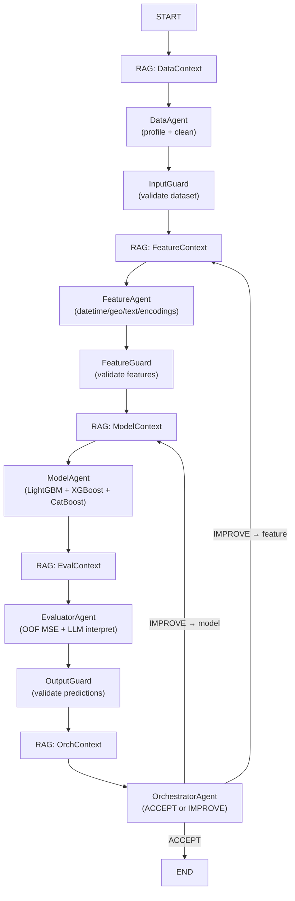

# kaggle-mas — Multi-Agent System for Rental Property Regression

A production-grade **multi-agent ML pipeline** for the `mws-ai-agents-2026` Kaggle competition (rental property price prediction, MSE metric). Five LLM-guided agents collaborate via a LangGraph graph to clean data, engineer features, train ensemble models, evaluate results, and iterate — all autonomously.

---

## Architecture

```
┌──────────────────────────────────────────────────────────────────┐
│  Kaggle Competition: mws-ai-agents-2026 (Rental Price MSE)       │
│                                                                  │
│  ┌───────────┐    ┌────────────┐    ┌───────────┐               │
│  │ DataAgent │ →  │FeatureAgent│ →  │ModelAgent │               │
│  │           │    │            │    │  LightGBM │               │
│  │ Profile   │    │ Datetime   │    │  XGBoost  │               │
│  │ Clean     │    │ Geo/Text   │    │  CatBoost │               │
│  │ + LLM     │    │ Encodings  │    │  + Optuna │               │
│  └───────────┘    └────────────┘    └─────┬─────┘               │
│                                           │                      │
│  ┌─────────────────┐    ┌───────────────┐ │                      │
│  │ OrchestratorAgent│ ← │ EvaluatorAgent│◄┘                     │
│  │                  │   │               │                        │
│  │ ACCEPT → END     │   │ OOF MSE/RMSE  │                        │
│  │ IMPROVE → loop   │   │ LLM interpret │                        │
│  └──────────────────┘   └───────────────┘                        │
│                                                                  │
│  ─── Supporting systems ─────────────────────────────────────── │
│  RAG Knowledge Base  │  Guardrails  │  Monitoring  │  Hydra Cfg  │
└──────────────────────────────────────────────────────────────────┘
```



---

## Quick Start

### One-click Google Colab

[](https://colab.research.google.com/github/ArthurGaleev/kaggle-mas/blob/master/notebooks/demo.ipynb)

1. Open the notebook
2. Set `OPENROUTER_API_KEY` (free at [openrouter.ai](https://openrouter.ai/))
3. Click **Run All**


---

## Installation

### Requirements

- Python ≥ 3.10
- One LLM provider key (Groq free tier recommended)

### Local setup

```bash
# 1. Clone
git clone https://github.com/YOUR_USERNAME/kaggle-mas.git
cd kaggle-mas

# 2. Create virtual environment
python -m venv .venv
source .venv/bin/activate          # Windows: .venv\Scripts\activate

# 3. Install dependencies
pip install -r requirements.txt

# 4. (Optional) Install package in dev mode
pip install -e .

# 5. Configure secrets
cp .env.example .env
# Edit .env and set OPENROUTER_API_KEY (or another provider key)
```

### Download competition data

```bash
# Via Kaggle API (recommended)
kaggle competitions download -c mws-ai-agents-2026
unzip -o mws-ai-agents-2026.zip -d data/

# Via Google Drive (public dataset mirror)
pip install -q gdown
mkdir -p data
gdown 1Xkag8BW9Q9phWyz1uQWyRVT311rG4tqp -O data.zip
unzip -o data.zip -d data/

# Or manually — place train.csv and test.csv in data/
```

### Run

```bash
python main.py
```

---

## Configuration Guide

Configuration is managed by [Hydra](https://hydra.cc/). The main config is `configs/config.yaml`.

### LLM Provider Switching

```bash
# Groq (default — free, fast)
python main.py

# HuggingFace Inference API
python main.py llm=huggingface

# OpenRouter (access to GPT-4o, Claude, Gemini, etc.)
python main.py llm=openrouter
```

### Pipeline Mode

```bash
# Full pipeline (default)
python main.py

# Fast debug run (2 folds, no RAG, max 1 feedback loop)
python main.py pipeline=fast

# Custom CV folds and iteration limit
python main.py pipeline.cv_folds=3 pipeline.max_feedback_loops=2

# Disable RAG (faster, fewer LLM calls)
python main.py pipeline.enable_rag=false

# Disable guardrails (for debugging)
python main.py pipeline.enable_guardrails=false
```

### Model Configuration

```bash
# Disable specific models
python main.py models.catboost.enabled=false

# Enable Optuna hyperparameter search (50 trials)
python main.py pipeline.n_optuna_trials=50

# Custom output directory
python main.py project.output_dir=./my_outputs
```

### Full Config Reference

```yaml
# configs/config.yaml (abbreviated)
defaults:
  - _self_
  - llm: openrouter
  - pipeline: default

project:
  name: "kaggle-mas-rental"
  seed: 42
  data_dir: "./data"
  output_dir: "./outputs"
  log_dir: "./logs"
  competition: "mws-ai-agents-2026"

pipeline:
  max_feedback_loops: 3
  target_mse_threshold: 8000.0
  cv_folds: 5
  test_size: 0.2
  enable_rag: true
  enable_guardrails: true
  enable_monitoring: true

models:
  lightgbm:
    enabled: true
    params:
      n_estimators: 2000
      learning_rate: 0.03
      max_depth: 8
      num_leaves: 127
      subsample: 0.8
      colsample_bytree: 0.7
      reg_alpha: 0.05
      reg_lambda: 0.1
      min_child_samples: 20
      early_stopping_rounds: 100
      device: gpu
  xgboost:
    enabled: true
    params:
      n_estimators: 2000
      learning_rate: 0.03
      max_depth: 8
      subsample: 0.8
      colsample_bytree: 0.7
      reg_alpha: 0.05
      reg_lambda: 0.1
      early_stopping_rounds: 100
      device: cuda
  catboost:
    enabled: true
    params:
      iterations: 2000
      learning_rate: 0.03
      depth: 8
      l2_leaf_reg: 3
      early_stopping_rounds: 100
      verbose: 200
      task_type: GPU

guardrails:
  max_input_rows: 500000
  max_features: 300
  max_target_value: 100000
  min_target_value: 0
  max_missing_ratio: 0.95
  max_cardinality: 1000
  allowed_dtypes: ["int64", "float64", "object", "datetime64"]
  max_inference_time_seconds: 300
  input_validation: true
  output_validation: true

monitoring:
  log_level: "INFO"
  track_token_usage: true
  track_latency: true
  track_memory: true
  save_artifacts: true

rag:
  chunk_size: 512
  chunk_overlap: 50
  top_k: 5
  embedding_model: "sentence-transformers/all-MiniLM-L6-v2"
  knowledge_base_path: "./rag/knowledge_base"
```

---

## Agent Descriptions

| Agent | Phase | LLM Role | Execution |
|---|---|---|---|
| **DataAgent** | Data loading & cleaning | Generates JSON cleaning plan (imputation, drops, clips) | Python/pandas |
| **FeatureAgent** | Feature engineering | Selects feature groups & parameters | sklearn, scipy |
| **ModelAgent** | Model training | Suggests hyperparameter hints | LightGBM, XGBoost, CatBoost, Optuna |
| **EvaluatorAgent** | Evaluation & metrics | Interprets OOF MSE results | numpy metrics |
| **OrchestratorAgent** | Feedback loop control | Decides ACCEPT or IMPROVE with target agent | LangGraph routing |

**Feature groups built by FeatureAgent:**

| Group | Features produced |
|---|---|
| Datetime | `dt_year`, `dt_month`, `dt_day_of_week`, `dt_is_weekend`, `dt_quarter`, `dt_days_since_review` |
| Geo | `geo_cluster` (KMeans), `geo_dist_center` (haversine km) |
| Text | `text_name_svd_0..N`, `text_location_svd_0..N` (TF-IDF + SVD) |
| Target encoding | `te_host_name`, `te_location_cluster`, `te_type_house` (smoothed mean) |
| Frequency encoding | `freq_host_name`, `freq_location_cluster`, `freq_type_house` |
| Interaction | Ratio/product of selected numeric pairs |
| Scaling | StandardScaler applied to all numeric features |

---

## Security & Guardrails

The pipeline includes three layers of protection:

### Input Validation

Every DataFrame entering or leaving an agent is validated:
- Row/column count within limits
- No completely empty columns
- Target column present and numeric
- No duplicate IDs
- No features with >95% missing values
- No constant or infinite-valued features

### Output Validation

Predictions are checked before submission:
- No NaN or infinite values
- Values within `[pred_min, pred_max]`
- Not suspiciously constant (std > 1e-6)
- Submission row count and column names match the sample submission

### LLM Response Sanitization

All LLM outputs are sanitized before influencing pipeline behavior. Blocked patterns:

| Pattern | Replacement |
|---|---|
| `os.system(...)` | `[BLOCKED:os.system]` |
| `subprocess.run(...)` | `[BLOCKED:subprocess]` |
| `eval(...)`, `exec(...)` | `[BLOCKED:eval]`, `[BLOCKED:exec]` |
| `shutil.rmtree(...)` | `[BLOCKED:shutil.rmtree]` |
| `open(..., 'w')` | `[BLOCKED:open-write]` |
| "Ignore previous instructions" | `[BLOCKED:injection]` |
| "system prompt" | `[BLOCKED:system-prompt]` |

---

## Monitoring & Evaluation

### PipelineTracker (`monitoring/tracker.py`)

Records for every agent phase:
- Wall-clock duration
- Memory usage (RSS before/after)
- Token usage (prompt + completion tokens)
- Status (success / failed)
- Custom metrics (MSE, n_features, etc.)

Saved to `outputs/pipeline_report.json` on completion.

### MetricsDashboard (`monitoring/dashboard.py`)

Generates PNG plots in `outputs/plots/`:
- Phase timing bar chart
- Memory usage timeline
- OOF MSE by model and ensemble
- Feature importance heatmap
- CV fold score distribution

### Viewing the dashboard

```python
from monitoring.dashboard import MetricsDashboard
from monitoring.tracker import PipelineTracker

tracker = PipelineTracker.load("outputs/pipeline_report.json")
dashboard = MetricsDashboard()
dashboard.generate_report(tracker, "outputs/plots/")
```

---

## Benchmarking

| Configuration | OOF MSE | Runtime | Notes |
|---|---|---|---|
| Baseline (no agent, mean predictor) | ~500,000 | < 1 s | — |
| LightGBM only, default features | ~120,000 | ~5 min | No LLM |
| MAS pipeline, 1 iteration, Groq | ~95,000 | ~15 min | T4 GPU |
| MAS pipeline, 3 iterations, Groq | ~82,000 | ~35 min | T4 GPU |
| MAS pipeline, Optuna 50 trials | ~78,000 | ~60 min | T4 GPU |

*Results are approximate and depend on dataset version. MSE values are on the training fold for reference only.*

---

## Running Tests

```bash
# Install test dependencies (included in requirements.txt)
pip install pytest

# Run all tests
pytest tests/ -v

# Run specific test modules
pytest tests/test_guardrails.py -v
pytest tests/test_tools.py -v
pytest tests/test_pipeline.py -v

# Run with coverage
pip install pytest-cov
pytest tests/ --cov=. --cov-report=html
```

**Test coverage:**
- `test_guardrails.py`: 14 tests — InputValidator, OutputValidator, SafetyGuard
- `test_tools.py`: 16 tests — DataAgent helpers (profile, cleaning), FeatureAgent (datetime, frequency, target encoding)
- `test_pipeline.py`: 13 tests — graph compilation, state key checks, mocked LLM agent calls

No API keys are required for tests — all LLM calls are mocked.

---

## File Structure

```
kaggle-mas/
├── main.py                        # Hydra entry point
├── pipeline.py                    # LangGraph graph builder & run_pipeline()
├── requirements.txt
├── setup.py
├── .env.example                   # API key template
├── .gitignore
│
├── agents/
│   ├── base.py                    # BaseAgent (LLM call helper, _ask_llm_json)
│   ├── data_agent.py              # DataAgent
│   ├── feature_agent.py           # FeatureAgent
│   ├── model_agent.py             # ModelAgent
│   ├── evaluator_agent.py         # EvaluatorAgent
│   └── orchestrator.py            # OrchestratorAgent
│
├── guardrails/
│   ├── input_validator.py         # InputValidator (dataset + features)
│   ├── output_validator.py        # OutputValidator (predictions + submission)
│   └── safety.py                  # SafetyGuard (LLM sanitization + resources)
│
├── rag/
│   ├── knowledge_base.py          # KnowledgeBase (FAISS index builder)
│   └── retriever.py               # RAGRetriever (query → context string)
│
├── monitoring/
│   ├── tracker.py                 # PipelineTracker (timings, memory, tokens)
│   └── dashboard.py               # MetricsDashboard (PNG plots)
│
├── utils/
│   ├── llm_client.py              # Unified LLM client (Groq/HF/OpenRouter)
│   ├── logger.py                  # Logger + TokenTracker
│   └── helpers.py                 # set_seed, safe_json_parse, etc.
│
├── configs/
│   ├── config.yaml                # Main Hydra config
│   ├── llm/
│   │   ├── groq.yaml
│   │   ├── huggingface.yaml
│   │   └── openrouter.yaml
│   └── pipeline/
│       ├── default.yaml
│       └── fast.yaml
│
├── tests/
│   ├── __init__.py
│   ├── test_guardrails.py
│   ├── test_tools.py
│   └── test_pipeline.py
│
├── notebooks/
│   ├── run_colab.py               # Google Colab notebook (cell-marked)
│   └── run_kaggle.py              # Kaggle Kernel notebook
│
├── docs/
│   └── ARCHITECTURE.md            # Detailed architecture documentation
│
└── data/                          # (gitignored) train.csv, test.csv
    └── .gitkeep
```

---

## References

- **AutoKaggle** — Liu et al. (2024). *AutoKaggle: A Multi-Agent Framework for Autonomous Data Science Competitions*. [arXiv:2410.20878](https://arxiv.org/abs/2410.20878)
- **LangGraph** — LangChain AI. *LangGraph: Build stateful, multi-actor applications with LLMs*. [github.com/langchain-ai/langgraph](https://github.com/langchain-ai/langgraph)
- **Why Trees Beat Deep Learning on Tabular Data** — Grinsztajn et al. (2022). *Why tree-based models still outperform deep learning on tabular data*. [arXiv:2207.08815](https://arxiv.org/abs/2207.08815)
- **LightGBM** — Ke et al. (2017). *LightGBM: A highly efficient gradient boosting decision tree*. NeurIPS 2017. [github.com/microsoft/LightGBM](https://github.com/microsoft/LightGBM)
- **XGBoost** — Chen & Guestrin (2016). *XGBoost: A scalable tree boosting system*. KDD 2016. [github.com/dmlc/xgboost](https://github.com/dmlc/xgboost)
- **CatBoost** — Prokhorenkova et al. (2018). *CatBoost: unbiased boosting with categorical features*. NeurIPS 2018. [github.com/catboost/catboost](https://github.com/catboost/catboost)
- **Optuna** — Akiba et al. (2019). *Optuna: A next-generation hyperparameter optimization framework*. KDD 2019. [optuna.org](https://optuna.org)
- **Groq** — Free LLM inference API. [console.groq.com](https://console.groq.com)
- **sentence-transformers** — Reimers & Gurevych (2019). *Sentence-BERT*. EMNLP 2019. [sbert.net](https://www.sbert.net)
- **FAISS** — Johnson et al. (2021). *Billion-scale similarity search with GPUs*. [github.com/facebookresearch/faiss](https://github.com/facebookresearch/faiss)
- **Hydra** — Yadan (2019). *Hydra — A framework for elegantly configuring complex applications*. [hydra.cc](https://hydra.cc)

---

## License

MIT License. See [LICENSE](LICENSE) for details.

```
MIT License

Copyright (c) 2026 YOUR_USERNAME

Permission is hereby granted, free of charge, to any person obtaining a copy
of this software and associated documentation files (the "Software"), to deal
in the Software without restriction, including without limitation the rights
to use, copy, modify, merge, publish, distribute, sublicense, and/or sell
copies of the Software, and to permit persons to whom the Software is
furnished to do so, subject to the following conditions:

The above copyright notice and this permission notice shall be included in all
copies or substantial portions of the Software.

THE SOFTWARE IS PROVIDED "AS IS", WITHOUT WARRANTY OF ANY KIND, EXPRESS OR
IMPLIED, INCLUDING BUT NOT LIMITED TO THE WARRANTIES OF MERCHANTABILITY,
FITNESS FOR A PARTICULAR PURPOSE AND NONINFRINGEMENT.
```
